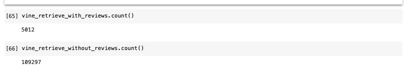
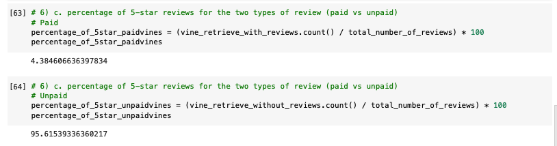

# Amazon_Vine_Analysis

## Overview of the analysis
I picked a dataset comprised of reviews from Amazon and used PySpark to perform the ETL process for extracting the dataset, transforming the data, and performing some analysis. Finally, I used PySpark and postgres to determine if there is any bias toward favorable reviews from Vine members in the dataset. Finally, I provided a summary of the analysis for Jennifer to submit to the SellBy stakeholders.

## Results 
- How many Vine reviews and non-Vine reviews were there?
  ##### _Vine_

  ##### _non-Vine_
  
- How many Vine reviews were 5 stars (top)? How many non-Vine reviews were 5 stars (bottom)?
 
  
- What percentage of Vine reviews were 5 stars with vine (top)? What percentage of non-Vine reviews were 5 stars with vine (bottom)?
 
  
- State if there is any positivity bias for reviews in the Vine program. Use the results of the analysis to support the statement. 

  

## Summary

### Appendix
- Jupyter Notebook
  - Please see - Vine_Review_Analysis-3.ipynb 
- Data Source: 
  - amazonaws.com/amazon-reviews-pds/tsv/amazon_reviews_us_Books_v1_00.tsv.gz
- Software, apps, libraries:
  - Python
  - pgAdmin/postgres
  - Pyspark
